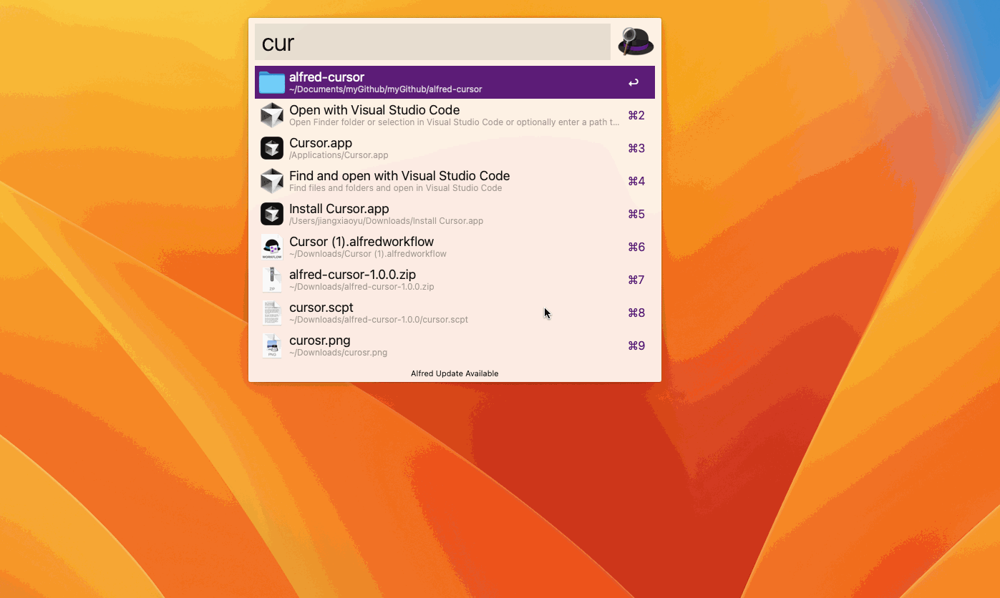

# Cursor AI这么火，却没有配套Alfred工作流？手撸一个

## 目录
- [Cursor AI这么火，却没有配套Alfred工作流？手撸一个](#cursor-ai这么火却没有配套alfred工作流手撸一个)
  - [目录](#目录)
  - [前言](#前言)
  - [效果演示](#效果演示)
  - [下载与使用](#下载与使用)
  - [AppleScript 简介](#applescript-简介)
    - [什么是 AppleScript？](#什么是-applescript)
    - [AppleScript 基本语法](#applescript-基本语法)
    - [如何运行 AppleScript](#如何运行-applescript)
    - [AppleScript 文件后缀](#applescript-文件后缀)
  - [AppleScript 开发指南](#applescript-开发指南)
    - [脚本编辑器的使用](#脚本编辑器的使用)
    - [参数传递与测试](#参数传递与测试)
  - [AppleScript vs Node.js](#applescript-vs-nodejs)

## 前言
最近Cursor编辑器非常流行，但在使用时遇到无法配合Alfred快捷打开的问题。本项目旨在解决这一问题，提供一个方便的Alfred工作流。

## 效果演示


## 下载与使用
- [下载链接](https://github.com/jiangxiaoyu66/alfred-cursor/releases/download/1.0.0/Cursor.alfredworkflow)
- [GitHub仓库](https://github.com/jiangxiaoyu66/alfred-cursor)

## AppleScript 简介

### 什么是 AppleScript？
AppleScript是一种用于自动化Mac OS应用程序的脚本语言，允许用户通过编写脚本来控制应用程序的行为。

### AppleScript 基本语法
AppleScript的语法简单，类似自然语言。示例：

```applescript
tell application "Finder"
    activate
    open folder "Documents"
end tell
```

### 如何运行 AppleScript
可以使用Mac OS自带的"脚本编辑器"应用程序或安装了相应插件的VSCode等编辑器。

### AppleScript 文件后缀
- `.scpt`: 标准AppleScript文件
- `.app`: 可执行的AppleScript应用程序

## AppleScript 开发指南

### 脚本编辑器的使用
1. 打开Mac自带的脚本编辑器应用
   
2. 新建脚本
   

### 参数传递与测试
1. **硬编码参数**：在脚本中直接定义参数，例如：

```applescript
on run
    display dialog "传入的参数是: Hello, World!"
end run
```

2. **使用命令行**：通过命令行运行脚本并传入参数：

```bash
osascript /path/to/your_script.scpt "What's up, man!"
```

效果如下：


## AppleScript vs Node.js
AppleScript专为macOS系统自动化设计，适合快速创建系统级自动化任务。Node.js则是更通用的编程平台，适合开发各种类型的应用，尤其是网络应用和服务器端程序。

