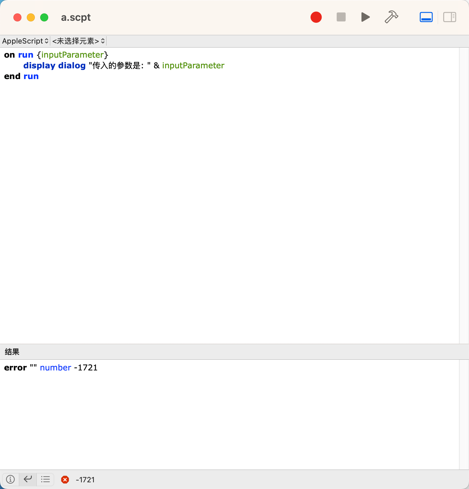

TODO: 插入动图说明效果。


最近Cursor真的很活，身边好多朋友都在推荐，我也试用了一下，觉得很好用，推荐给大家。
但在用的时候遇到一个问题，没办法配合Alfred，用快捷指令打开啊。

众所周知，Alfred配合工作流那是相当的方便，Cursor每次让我手动选择文件夹，真的有让我Egg疼。

没办法，手撸一个了。其实参考了Alfred的Vscode工作流的配置，写起来还是很简单的哈，也让我认识了一下，什么是AppleScript。

需要使用可以自取：
TODO： 插入下载链接和github链接。


那如果你想详细了解下什么是AppleScript呢，可以继续往下看：


## 什么是AppleScript？

AppleScript是一种用于自动化Mac OS应用程序的脚本语言。它允许用户通过编写脚本来控制应用程序的行为，从而实现任务的自动化。

### AppleScript的基本语法

AppleScript的语法相对简单，类似于自然语言。以下是一些基本示例：

```applescript
  tell application "Finder"
  activate
  open folder "Documents"
  end tell
```


### 使用AppleScript的优势

1. **自动化重复任务**：可以通过脚本自动执行日常任务，节省时间。
2. **与多种应用集成**：可以与多种Mac应用程序（如Finder、Safari等）进行交互。
3. **提高工作效率**：通过自动化工作流程，提高整体工作效率。

### 如何运行AppleScript

你可以使用“脚本编辑器”应用程序来编写和运行AppleScript。脚本编辑器是Mac OS自带的应用程序，专门用于创建和编辑AppleScript脚本。只需打开应用程序，输入你的脚本，然后点击“运行”按钮即可。

如果你更喜欢使用其他编辑器，可以考虑使用VSCode等代码编辑器，但需要确保安装相应的插件来支持AppleScript的语法高亮和代码提示。

### AppleScript文件后缀

AppleScript文件通常以`.scpt`为后缀，这种格式的文件可以直接在“脚本编辑器”中打开和运行。此外，AppleScript也可以保存为应用程序格式，后缀为`.app`，这样可以直接双击运行。


## 结论

通过使用AppleScript，你可以大大提高在Mac上的工作效率，尤其是在与Alfred等工具结合使用时。希望这篇文章能帮助你更好地理解和使用AppleScript！


# 脚本编辑器的使用



```
on run {inputParameter}
    display dialog "传入的参数是: " & inputParameter
end run
```

```
-- 脚本文件: example.scpt
on run argv
    if (count of argv) > 0 then
        display dialog "传入的参数是: " & item 1 of argv
    else
        display dialog "没有传入参数"
    end if
end run
```


在“脚本编辑器”中直接运行AppleScript时，确实无法通过图形界面输入参数。你只能通过命令行或在脚本中硬编码参数来测试。
解决方案
硬编码参数：在脚本中直接定义参数，例如：
 
2. 使用命令行：如前所述，通过命令行运行脚本并传入参数：
```Bash
   osascript /path/to/your_script.scpt  "What's up,man\!"
```
效果如下：


使用方法
1. **创建脚本**：在“脚本编辑器”中输入上述代码。
2. **运行脚本**：点击“运行”按钮时，可以在弹出的对话框中输入参数，例如{"Hello, World!"}。
3. **查看结果**：脚本会显示传入的参数。### 通过命令行传入参数如果你希望通过命令行运行AppleScript并传入参数，可以使用以下命令：bash
osascript your_script.scpt "Hello, World!"


AppleScript 是一个专门为 macOS 系统自动化设计的脚本语言，适合快速创建系统级别的自动化任务。而 Node.js 是一个更通用、更强大的编程平台，适合开发各种类型的应用程序，尤其是网络应用和服务器端程序。